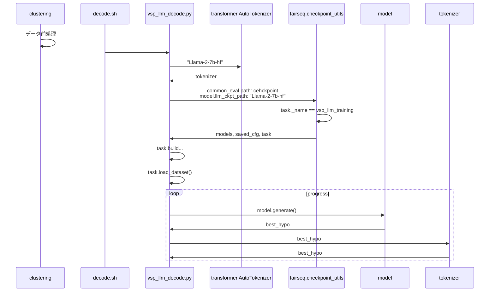

# VSP-LLM-App

## Deep dive in VSP-LLM

### Inference code

```mermaid
sequenceDiagram

participant clustering
participant decode.sh
participant vsp_llm_decode.py
participant transformer.AutoTokenizer

clustering->>clustering: データ前処理
decode.sh->>vsp_llm_decode.py: 
vsp_llm_decode.py->>transformer.AutoTokenizer: "Llama-2-7b-hf"
transformer.AutoTokenizer->>vsp_llm_decode.py: tokenizer
vsp_llm_decode.py->>fairseq.checkpoint_utils: common_eval.path: cehckpoint<br/>model.llm_ckpt_path: "Llama-2-7b-hf"
fairseq.checkpoint_utils->>fairseq.checkpoint_utils: task._name == vsp_llm_training
fairseq.checkpoint_utils->>vsp_llm_decode.py: models, saved_cfg, task
vsp_llm_decode.py->>vsp_llm_decode.py: task.build...
vsp_llm_decode.py->>vsp_llm_decode.py: task.load_dataset()
loop progress
    vsp_llm_decode.py->>model: model.generate()
    model->>vsp_llm_decode.py: best_hypo
    vsp_llm_decode.py->>tokenizer: best_hypo
    tokenizer->>vsp_llm_decode.py: best_hypo
end
```
